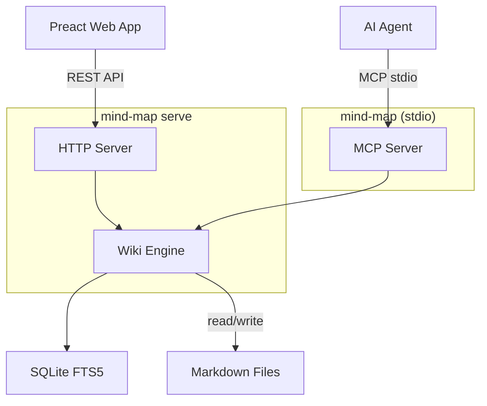

# mind-map

[](https://github.com/aniongithub/mind-map/actions/workflows/ci.yml)

**A wiki for AI agents — and humans too.**

`mind-map` is a wiki engine that stores pages as plain markdown files, indexes them with SQLite FTS5, and exposes them via MCP (for AI agents) and a REST API with web UI (for humans). One binary, zero runtime dependencies.

## The Problem

AI agents need persistent, structured memory. Today that means:

- **Desktop apps** -- tools like Tolaria require Node.js + Rust + WebKit + a display server just to give agents a knowledge base
- **No web access** -- the knowledge is locked in a desktop app only the local user can see
- **Can't deploy headless** -- needs a GUI environment even when no human is looking

## The Solution

`mind-map` is a **server**, not an app. It runs anywhere -- your laptop, a container or a cloud VM.

1. **Agents use stdio** -- `mind-map` with no args starts an MCP server on stdin/stdout
2. **Humans use the web UI** -- `mind-map serve` starts an HTTP server with REST API and browser UI
3. **One binary** -- Go, statically compiled, `curl | bash` to install
4. **Plain markdown** -- pages are `.md` files with YAML frontmatter. Git-friendly, portable, yours
5. **Multi-process safe** -- SQLite page locking lets multiple agents share the same wiki directory

```
Agent: "What do we know about authentication?"
  → search_pages("authentication")
  → get_page("architecture/auth")
  → ✅ Full page with frontmatter, links, and backlinks
```

## Quick Install

### Linux / macOS

```bash
curl -fsSL https://github.com/aniongithub/mind-map/releases/latest/download/install.sh | bash
```

### Windows

```powershell
Invoke-RestMethod https://github.com/aniongithub/mind-map/releases/latest/download/install.ps1 | Invoke-Expression
```

Binaries available for **linux-x64**, **linux-arm64**, **darwin-x64**, **darwin-arm64**, **windows-x64**, and **windows-arm64**.

## Architecture



The web UI is a static Preact app served by `mind-map serve`. It uses a REST API to read and write pages. AI agents use stdio MCP -- each agent launches its own `mind-map` process.

## Two Modes

| Mode | Command | Use case |
|------|---------|----------|
| **stdio** (default) | `mind-map` | AI agents (Copilot, Claude, Cursor) |
| **HTTP** | `mind-map serve` | Web UI for humans |

Both modes use the same wiki engine and the same wiki directory (`~/.mind-map/wiki` by default). Multiple stdio processes can safely share the same wiki via SQLite page locking.

## MCP Tools (8 total)

| Tool | Description |
|------|-------------|
| `search_pages` | Full-text search across page titles and content (SQLite FTS5) |
| `get_wiki_context` | Wiki overview — page count, top-level directories, recent pages |
| `get_page` | Read a page with parsed frontmatter, body, outgoing links, and backlinks |
| `create_page` | Create a new page (markdown with optional YAML frontmatter) |
| `update_page` | Update an existing page's content |
| `delete_page` | Delete a page from the wiki and search index |
| `list_pages` | List pages, optionally filtered by path prefix |
| `get_backlinks` | Get all pages that link to a given page |

| `register_sync` | Register a wiki path prefix to sync with a git remote |

## Wiki Features

- **YAML frontmatter** -- structured metadata on every page (`title`, `type`, `status`, custom fields)
- **Wikilinks** -- `[[target]]` and `[[display|target]]` syntax, resolved to clickable links
- **Backlink index** -- every page knows what links to it
- **Full-text search** -- SQLite FTS5 with ranked results and snippets
- **Multi-process safe** -- SQLite page locking for concurrent agent access
- **Git sync** -- sync wiki pages to GitHub repo wikis via configurable mappings

## Web UI

The built-in web UI is a metro-inspired, chromeless Preact app:

- Sidebar with page list and search
- Markdown rendering with wikilinks as clickable links
- Backlinks section on every page
- Edit mode with raw markdown editor
- Dark / light theme toggle

The web UI speaks the same language as the wiki engine. If an agent creates a page via stdio, it appears in the browser. If you edit in the browser, the agent sees the change on its next read.

## MCP Client Configuration

```json
{
  "mcpServers": {
    "mind-map": {
      "type": "local",
      "command": "mind-map",
      "args": [],
      "tools": ["*"]
    }
  }
}
```

That's it. No args needed -- stdio mode and `~/.mind-map/wiki` are the defaults. Override the directory with `--dir` if needed.

## Page Format

Pages are plain markdown files with optional YAML frontmatter:

```markdown
---
title: Authentication Architecture
type: design-doc
status: approved
---
# Authentication Architecture

We use JWT tokens for API auth. See [[api/tokens]] for implementation.

Related: [[security/threat-model]], [[api/rate-limiting]]
```

The wiki engine extracts:
- **Title** from frontmatter `title:`, first `# heading`, or filename
- **Frontmatter** as structured key-value metadata
- **Wikilinks** (`[[target]]`) as outgoing links → stored in the backlink index

## Development

Development happens inside a [dev container](https://containers.dev/) — a reproducible, containerized environment defined by `.devcontainer/devcontainer.json`. This means no local Go or Node install required; everything runs in the container.

You can manage the devcontainer with VS Code, [devcontainer-mcp](https://www.anionline.me/devcontainer-mcp/), or the [devcontainer CLI](https://github.com/devcontainers/cli).

### VS Code (recommended)

Open the repo in VS Code — it will prompt to reopen in the devcontainer. Or clone directly into one:

> `Ctrl+Shift+P` → **Dev Containers: Clone Repository in Container Volume**

Once inside, everything is ready:

- **`Ctrl+Shift+B`** — build webui (default build task)
- **`F5`** with **`mind-map + WebUI`** — starts the Go server + opens Chrome
- **`watch-webui`** task — webpack watch for live reload

### devcontainer-mcp

If you use AI coding agents, [devcontainer-mcp](https://www.anionline.me/devcontainer-mcp/) lets the agent spin up and work inside the container directly — no manual setup.

### CLI

```bash
devcontainer up --workspace-folder .
devcontainer exec --workspace-folder . bash -c "cd webui && npm install && npm run build"
devcontainer exec --workspace-folder . bash -c "go test ./..."
```

### CI/CD

- **Pull Requests** — builds webui, runs `go vet`, `go test` in the devcontainer
- **Releases** — creating a GitHub release cross-compiles for all 4 platforms and uploads binaries + install scripts

## License

[MIT](LICENSE)
