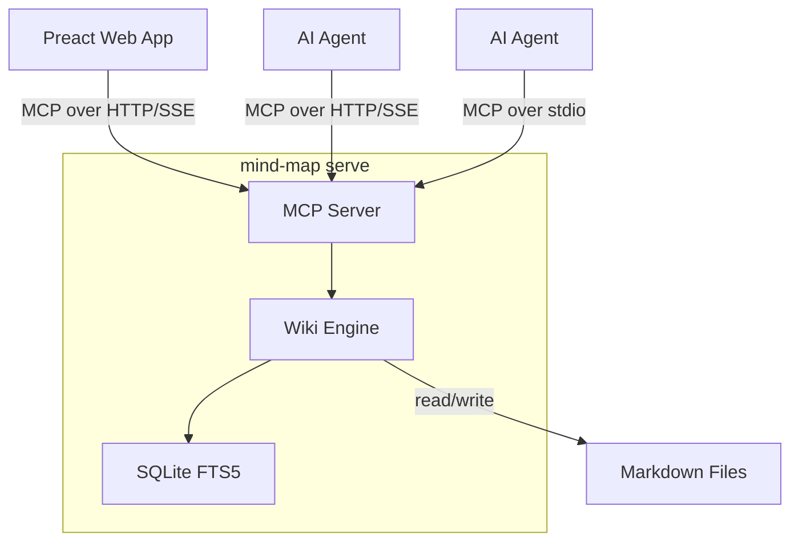

# mind-map

[](https://github.com/aniongithub/mind-map/actions/workflows/ci.yml)

**A wiki for AI agents — and humans too.**

`mind-map` is a wiki engine that stores pages as plain markdown files, indexes them with SQLite FTS5, and exposes everything via MCP over HTTP/SSE. AI agents and humans connect to the same server using the same protocol. One binary, zero runtime dependencies.

## The Problem

AI agents need persistent, structured memory. Today that means:

- 🔴 **Desktop apps** — tools like Tolaria require Node.js + Rust + WebKit + a display server just to give agents a knowledge base
- 🔴 **Single-user** — stdio MCP is one agent, one pipe, that's it
- 🔴 **No web access** — the knowledge is locked in a desktop app only the local user can see
- 🔴 **Can't deploy headless** — needs a GUI environment even when no human is looking

## The Solution

`mind-map` is a **server**, not an app. It runs anywhere — your laptop, a container or a cloud VM.

1. **One protocol** — MCP over HTTP/SSE. The web UI and AI agents are both MCP clients
2. **One binary** — Go, statically compiled, `curl | bash` to install
3. **Plain markdown** — pages are `.md` files with YAML frontmatter. Git-friendly, portable, yours
4. **Multi-agent** — HTTP/SSE means any number of agents can connect simultaneously
5. **Built-in web UI** — browse, search, and edit the wiki from any browser

```
Agent: "What do we know about authentication?"
  → search_pages("authentication")
  → get_page("architecture/auth")
  → ✅ Full page with frontmatter, links, and backlinks
```

## Quick Install

### Linux / macOS

```bash
curl -fsSL https://raw.githubusercontent.com/aniongithub/mind-map/main/install.sh | bash
```

### Windows (via WSL)

```powershell
Invoke-RestMethod https://github.com/aniongithub/mind-map/releases/latest/download/install.ps1 | Invoke-Expression
```

> **How it works:** The binary runs inside WSL; MCP clients on Windows launch it via `wsl ~/.local/bin/mind-map serve --stdio`. WSL 2 is required — install it with `wsl --install` if you haven't already.

Binaries available for **linux-x64**, **linux-arm64**, **darwin-x64**, and **darwin-arm64**.

## Architecture



The web UI is a static Preact app served from the same binary. It connects to the MCP SSE endpoint at `/mcp` — the same endpoint AI agents use. There is no separate REST API.

## Two Modes, One Server

| Mode | Command | Use case |
|------|---------|----------|
| **HTTP/SSE** (default) | `mind-map serve --dir ~/wiki` | Web UI + multiple agents |
| **stdio** | `mind-map serve --stdio --dir ~/wiki` | Single agent (Copilot, Claude Desktop, Cursor) |

Both modes use the same wiki engine, same MCP tools, same code path. The only difference is the transport.

## MCP Tools (8 total)

| Tool | Description |
|------|-------------|
| `search_pages` | Full-text search across page titles and content (SQLite FTS5) |
| `get_wiki_context` | Wiki overview — page count, top-level directories, recent pages |
| `get_page` | Read a page with parsed frontmatter, body, outgoing links, and backlinks |
| `create_page` | Create a new page (markdown with optional YAML frontmatter) |
| `update_page` | Update an existing page's content |
| `delete_page` | Delete a page from the wiki and search index |
| `list_pages` | List pages, optionally filtered by path prefix |
| `get_backlinks` | Get all pages that link to a given page |

## Wiki Features

- **YAML frontmatter** — structured metadata on every page (`title`, `type`, `status`, custom fields)
- **Wikilinks** — `[[target]]` and `[[display|target]]` syntax, resolved to clickable links
- **Backlink index** — every page knows what links to it
- **Full-text search** — SQLite FTS5 with ranked results and snippets
- **Concurrent access** — `sync.RWMutex` for safe multi-agent reads and writes

## Web UI

The built-in web UI is a metro-inspired, chromeless Preact app:

- Sidebar with page list and search
- Markdown rendering with wikilinks as clickable links
- Backlinks section on every page
- Edit mode with raw markdown editor
- Dark / light theme toggle

The web UI speaks MCP — it's an MCP client, not a separate interface. If an agent creates a page, it appears in the browser. If you edit in the browser, the agent sees the change.

## MCP Server Configuration

### Linux / macOS (stdio)

```json
{
  "mcpServers": {
    "mind-map": {
      "command": "mind-map",
      "args": ["serve", "--stdio", "--dir", "~/wiki"]
    }
  }
}
```

### Windows (WSL bridge)

```json
{
  "mcpServers": {
    "mind-map": {
      "command": "wsl",
      "args": ["~/.local/bin/mind-map", "serve", "--stdio", "--dir", "~/wiki"]
    }
  }
}
```

## Page Format

Pages are plain markdown files with optional YAML frontmatter:

```markdown
---
title: Authentication Architecture
type: design-doc
status: approved
---
# Authentication Architecture

We use JWT tokens for API auth. See [[api/tokens]] for implementation.

Related: [[security/threat-model]], [[api/rate-limiting]]
```

The wiki engine extracts:
- **Title** from frontmatter `title:`, first `# heading`, or filename
- **Frontmatter** as structured key-value metadata
- **Wikilinks** (`[[target]]`) as outgoing links → stored in the backlink index

## Development

Development happens inside a [dev container](https://containers.dev/) — a reproducible, containerized environment defined by `.devcontainer/devcontainer.json`. This means no local Go or Node install required; everything runs in the container.

You can manage the devcontainer with VS Code, [devcontainer-mcp](https://github.com/aniongithub/devcontainer-mcp), or the [devcontainer CLI](https://github.com/devcontainers/cli).

### VS Code (recommended)

Open the repo in VS Code — it will prompt to reopen in the devcontainer. Or clone directly into one:

> `Ctrl+Shift+P` → **Dev Containers: Clone Repository in Container Volume**

Once inside, everything is ready:

- **`Ctrl+Shift+B`** — build webui (default build task)
- **`F5`** with **`mind-map + WebUI`** — starts the Go server + opens Chrome
- **`watch-webui`** task — webpack watch for live reload

### devcontainer-mcp

If you use AI coding agents, [devcontainer-mcp](https://github.com/aniongithub/devcontainer-mcp) lets the agent spin up and work inside the container directly — no manual setup.

### CLI

```bash
devcontainer up --workspace-folder .
devcontainer exec --workspace-folder . bash -c "cd webui && npm install && npm run build"
devcontainer exec --workspace-folder . bash -c "CGO_ENABLED=1 go test -tags sqlite_fts5 ./..."
```

### CI/CD

- **Pull Requests** — builds webui, runs `go vet`, `go test` in the devcontainer
- **Releases** — creating a GitHub release cross-compiles for all 4 platforms and uploads binaries + install scripts

## License

[MIT](LICENSE)
