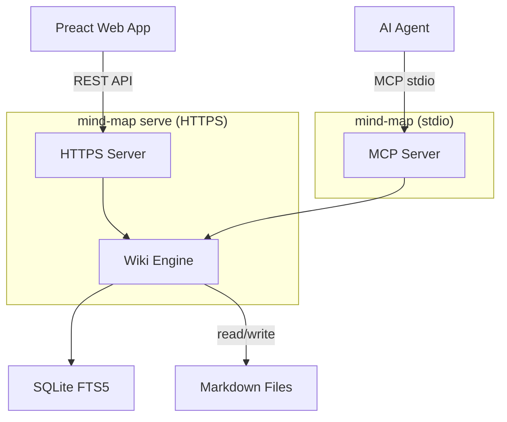

# mind-map

[](https://github.com/aniongithub/mind-map/actions/workflows/ci.yml)
[](https://www.anionline.me/mind-map)

**A wiki for AI agents — and humans too.**

`mind-map` is a wiki engine that stores pages as plain markdown files, indexes them with SQLite FTS5, and exposes them via MCP (for AI agents) and a REST API with web UI (for humans). One binary, zero runtime dependencies.

<p align="center">
  
</p>

> Works with **GitHub Copilot**, **Claude**, **Cursor**, and any MCP-compatible client.

## Why a wiki?

The idea of [LLM-maintained knowledge bases](https://gist.github.com/karpathy/442a6bf555914893e9891c11519de94f) — where AI agents build and curate a persistent wiki rather than re-discovering answers via RAG — has been gaining traction. Tools like Obsidian are built with the user in mind, not the agent. `mind-map` puts the agent and the human on equal ground.

| The problem | The solution |
|---|---|
| Desktop apps (Tolaria, Obsidian) need Node.js, Rust, WebKit, or a display server | **Server-first** — one static binary, runs headless, `curl \| bash` to install |
| Knowledge locked in a desktop app only the local user can see | **Agents use MCP, humans use the browser** at `https://mind-map.local` |
| Can't deploy headless — needs a GUI even when no human is looking | **Runs anywhere** — laptop, container, cloud VM |
| Hand-rolled search scripts that break at scale | **First-class search** — [SQLite FTS5](https://www.sqlite.org/fts5.html) with ranked results and snippets |
| Knowledge re-discovered via RAG on every query | **Persistent wiki** — wikilinks, backlinks, and plain `.md` files that grow over time |

```
Agent: "What do we know about authentication?"
  → search_pages("authentication")
  → get_page("architecture/auth")
  → ✅ Full page with frontmatter, links, and backlinks
```

## Quick Install

Unlike other wiki knowledge bases, you don't need a tutorial, system dependencies, or RAM-guzzling UIs. One command installs everything, ready for you or your agents to use. No tutorials, no bloat. Zero manual setup.

### Linux / macOS

```bash
curl -fsSL https://github.com/aniongithub/mind-map/releases/latest/download/install.sh | bash
```

### Windows

```powershell
Invoke-RestMethod https://github.com/aniongithub/mind-map/releases/latest/download/install.ps1 | Invoke-Expression
```

The installer:
- Downloads the binary and adds it to PATH
- Adds `127.0.0.1  mind-map.local` to your hosts file
- Generates a local TLS certificate so `https://mind-map.local` works with no browser warnings
- Optionally installs mind-map as a persistent system service

Binaries available for **linux-x64**, **linux-arm64**, **darwin-x64**, **darwin-arm64**, **windows-x64**, and **windows-arm64**.

## Architecture


```mermaid
graph TD
    A[Preact Web App] -->|REST API| B
    C[AI Agent] -->|MCP stdio| D

    subgraph "mind-map serve (HTTPS)"
        B[HTTPS Server] --> E[Wiki Engine]
    end

    subgraph "mind-map (stdio)"
        D[MCP Server] --> E
    end

    E --> F[SQLite FTS5]
    E -->|read/write| G[Markdown Files]
```

The web UI is a static Preact app served by `mind-map serve` over HTTPS. It uses a REST API to read and write pages. AI agents use stdio MCP — each agent launches its own `mind-map` process.

## Two Modes

| Mode | Command | Use case |
|------|---------|----------|
| **stdio** (default) | `mind-map` | AI agents (Copilot, Claude, Cursor) |
| **HTTPS** | `mind-map serve` | Web UI for humans at `https://mind-map.local` |

Both modes use the same wiki engine and the same wiki directory (`~/.mind-map/wiki` by default). Multiple stdio processes can safely share the same wiki via SQLite page locking.

## MCP Tools (9 total)

| Tool | Description |
|------|-------------|
| `search_pages` | Full-text search across page titles and content (SQLite FTS5) |
| `get_wiki_context` | Wiki overview — page count, top-level directories, recent pages |
| `get_page` | Read a page with parsed frontmatter, body, outgoing links, and backlinks |
| `create_page` | Create a new page (markdown with optional YAML frontmatter) |
| `update_page` | Update an existing page's content |
| `delete_page` | Delete a page from the wiki and search index |
| `list_pages` | List pages, optionally filtered by path prefix |
| `get_backlinks` | Get all pages that link to a given page |
| `register_sync` | Register a wiki path prefix to sync with a git remote |

## Wiki Features

- **YAML frontmatter** — structured metadata on every page (`title`, `type`, `status`, custom fields)
- **Wikilinks** — `[[target]]` and `[[display|target]]` syntax, resolved to clickable links
- **Backlink index** — every page knows what links to it
- **Full-text search** — SQLite FTS5 with ranked results and snippets
- **Multi-process safe** — SQLite page locking for concurrent agent access
- **Git sync** — sync wiki pages to GitHub repo wikis via configurable mappings

## Web UI

The built-in web UI is a metro-inspired, chromeless Preact app:

- Sidebar with page list and search
- Markdown rendering with wikilinks as clickable links
- Backlinks section on every page
- Edit mode with raw markdown editor
- Dark / light theme toggle

The web UI speaks the same language as the wiki engine. If an agent creates a page via stdio, it appears in the browser. If you edit in the browser, the agent sees the change on its next read.

## Service Management

The installer can set up mind-map as a persistent system service that starts on boot:

```bash
# Install and start the service
sudo mind-map service install --addr 127.0.0.1:443
sudo mind-map service start

# Manage
sudo mind-map service status
sudo mind-map service stop
sudo mind-map service uninstall
```

## TLS Setup

The installer automatically generates a local CA and server certificate so `https://mind-map.local` works without browser warnings. You can also manage certificates manually:

```bash
# Generate certs (as your user)
mind-map tls generate

# Install CA in system trust store (requires sudo on Linux)
sudo mind-map tls install-ca --tls-dir ~/.mind-map/tls

# Remove everything
mind-map tls remove
```

On Linux, Chrome uses its own NSS certificate store. The installer handles this automatically if `libnss3-tools` is available.

## MCP Client Configuration

```json
{
  "mcpServers": {
    "mind-map": {
      "type": "local",
      "command": "mind-map",
      "args": [],
      "tools": ["*"]
    }
  }
}
```

That's it. No args needed — stdio mode and `~/.mind-map/wiki` are the defaults. Override the directory with `--dir` if needed.

## Page Format

Pages are plain markdown files with optional YAML frontmatter:

```markdown
---
title: Authentication Architecture
type: design-doc
status: approved
---
# Authentication Architecture

We use JWT tokens for API auth. See [[api/tokens]] for implementation.

Related: [[security/threat-model]], [[api/rate-limiting]]
```

The wiki engine extracts:
- **Title** from frontmatter `title:`, first `# heading`, or filename
- **Frontmatter** as structured key-value metadata
- **Wikilinks** (`[[target]]`) as outgoing links → stored in the backlink index

## Development

Development happens inside a [dev container](https://containers.dev/) — a reproducible, containerized environment defined by `.devcontainer/devcontainer.json`. This means no local Go or Node install required; everything runs in the container.

You can manage the devcontainer with VS Code, [devcontainer-mcp](https://www.anionline.me/devcontainer-mcp/), or the [devcontainer CLI](https://github.com/devcontainers/cli).

### VS Code (recommended)

Open the repo in VS Code — it will prompt to reopen in the devcontainer. Or clone directly into one:

> `Ctrl+Shift+P` → **Dev Containers: Clone Repository in Container Volume**

Once inside, everything is ready:

- **`Ctrl+Shift+B`** — build webui (default build task)
- **`F5`** with **`mind-map + WebUI`** — starts the Go server + opens Chrome
- **`watch-webui`** task — webpack watch for live reload

### devcontainer-mcp

If you use AI coding agents, [devcontainer-mcp](https://www.anionline.me/devcontainer-mcp/) lets the agent spin up and work inside the container directly — no manual setup.

### CLI

```bash
devcontainer up --workspace-folder .
devcontainer exec --workspace-folder . bash -c "cd webui && npm install && npm run build"
devcontainer exec --workspace-folder . bash -c "go test ./..."
```

### CI/CD

- **Pull Requests** — builds webui, runs `go vet`, `go test` in the devcontainer
- **Releases** — creating a GitHub release cross-compiles for all 6 platforms and uploads binaries + install scripts

## License

[MIT](LICENSE)
