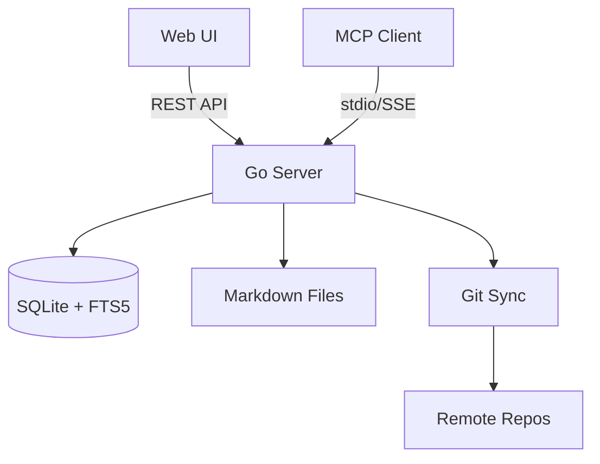

# mind-map

A wiki engine for AI agents and humans. Built with [[Go]].

Links back to [[index]].

## Feature Status

| Feature | Status | Notes |
|---------|--------|-------|
| Wiki engine | ✅ Done | SQLite-backed, FTS5 search |
| Wikilinks | ✅ Done | [[target]] and [[target|display]] |
| Backlinks | ✅ Done | Auto-tracked in DB |
| MCP server | ✅ Done | read, write, search tools |
| Web UI | 🔧 WIP | Sidebar, markdown, mermaid |
| Git sync | 🔧 WIP | Push/pull with remotes |
| Auth | ⏳ Planned | Token-based access |

## Architecture

